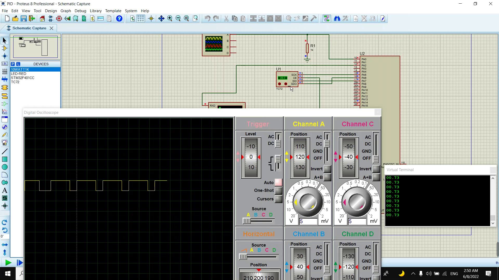

# Cooling Controller using STM32F401xC microcontroller and TC72 Temperature sensor

## Using PID controller to generate a PWM signal based on the deviation between the read temperature from the sensor and the set temperature point.

### The Cooling controller is working based on the following parameters.
- Temperature sampling period: 500ms.
- PWM duty cycle range: 0 to 0.73 and the value is shown on virtual terminal using UART
- Set temperature is 30.
- Values of the PID controller arguments are Kp = 0.1, Ki = 0.01 and Kd = 0

### Sample Image

### what I've learned through this project?
- Implementing Periodic Poller
- Implementing SPI Driver
- Interfacing with TC72 Temperature sensor
- Implementing PWM driver 
- Implementing PID controller
